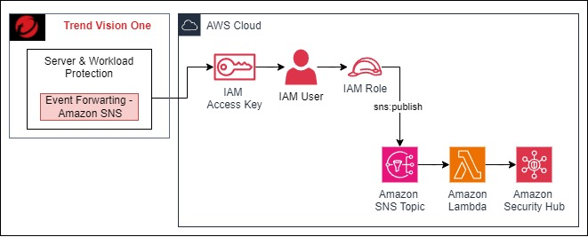

## Vision One Endpoint Security Server & Workload Protection custom integration with AWS Security Hub

This is an custom integrations of Security Hub, to send Workload Security events to Security Hub Findings with the use of the SNS Topic.

For this, it is necessary to have the following requirements:

> An active [Vision One](https://cloudone.trendmicro.com/home) account.

> An active [Cloud One](https://cloudone.trendmicro.com/home) account. (Trend Micro recommends migrating to Vision One to get the full power of Trend Micro)

> An [AWS account](https://aws.amazon.com/premiumsupport/knowledge-center/create-and-activate-aws-account/) where the Lambda, SNS and SecurityHub service will be used.

### Note:
This integration requires that the AWS account be integrated in Server & Workload Security with the use of the [Cloud Connector](https://docs.trendmicro.com/en-us/documentation/article/trend-vision-one-connecting-aws-accounts#GUID-F8FAF1DF-7A1E-4C0A-ADA3-6F6FC6CAD49D-oshfva) and the Server & Workload Security [agent installed](https://docs.trendmicro.com/en-us/documentation/article/trend-vision-one-add-aws-instances) and [configured](https://docs.trendmicro.com/en-us/documentation/article/trend-vision-one-create-policies) for the AWS instances.

## Integration

In this repository you will find a CloudFormation template which will create the following infrastructure.

When the template completes its creation in the Outputs you will find the necessary information to make the configuration in Cloud One Workload Security.
> SNS Topic, AccessKey, SecretKey
> [SNS Integration Workload Security](https://cloudone.trendmicro.com/docs/workload-security/event-sns/#3.)

## Contributing

If you encounter a bug, think of a useful feature, or find something confusing in the docs, please [create a new issue](https://github.com/trendmicro/v1-server-and-workload-integration-with-aws-securityhub/issues/new)!

We :heart: pull requests. If you'd like to fix a bug, contribute to a feature or just correct a typo, please feel free to do so.

If you're thinking of adding a new feature, consider opening an issue first to discuss it to ensure it aligns to the direction of the project (and potentially save yourself some time!).

## Support

Official support from Trend Micro is not available. Individual contributors may be Trend Micro employees, but are not official support.